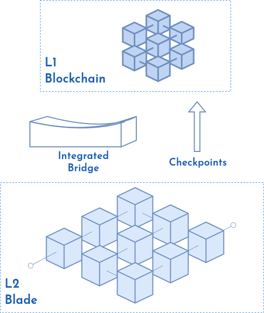
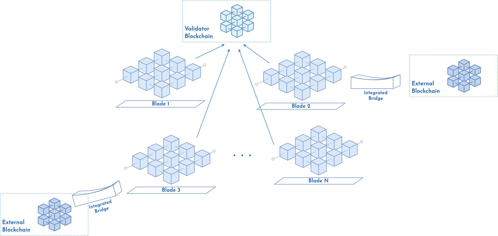

# Overview

## Introduction

Blade is a cutting-edge blockchain platform designed with a clear focus on enterprise needs. It is the ultimate choice for businesses aiming to harness the power of blockchain technology due to its exceptional speed and precision. It streamlines complex data management, optimizes supply chain, and secures transactions seamlessly.

<figure><figcaption>
Figure 1 - Blade Blockchain
</figcaption></figure>

## Main Features

The main features of Blade Blockchain include:

* Rapid transaction processing and low gas consumption (Table 1).

#### Table 1 - Transaction processing and gas consumption

| Scenario                        | Transactions per second | Gas per second |
| ------------------------------- | ----------------------- | -------------- |
| Multiple native token transfers | 2983                    | 62643000       |
| Multiple ERC20 transfers        | 1014                    | 62674768       |

* Highly configurable and customizable interfaces and system setup.
* Ethereum Virtual Machine (EVM) compatibility.
* Native Bridge integration right out of the box - General Message Passing feature (Figure 2).
* L1 solution configurable (Figure 2).

<figure><figcaption>
Figure 2 - Blade as L1 and Integrated (General Message Passing) bridge
</figcaption></figure>

* L2, L3,... solution configurable (Figure 3).

<figure><figcaption>
Figure 3 - Blade as L2 Layer
</figcaption></figure>

* Capable of constructing a hub of interconnected blockchains with shared validators (Figure 4).

<figure><figcaption>
Figure 4 - Hub of Blockchains
</figcaption></figure>

* Pluggable consensus mechanism.
* Configurable Stake and Reward tokens.
* User-Friendly user experience.
* Block Explorer.
* Free transactions, Account Abstraction, Governance, etc.
* Robust security measures to safeguard user data and transactions, incorporating advanced encryption techniques.
* Full compliance and auditing.
