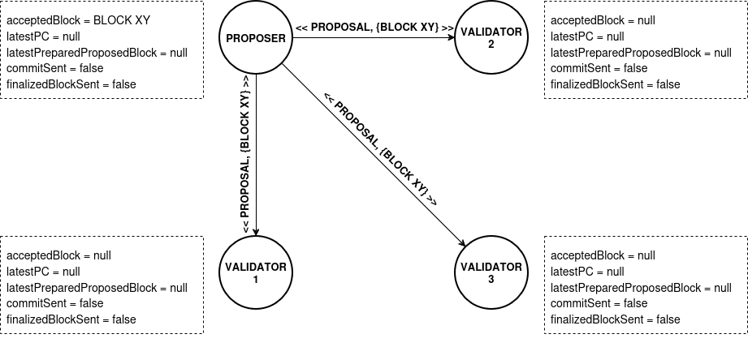
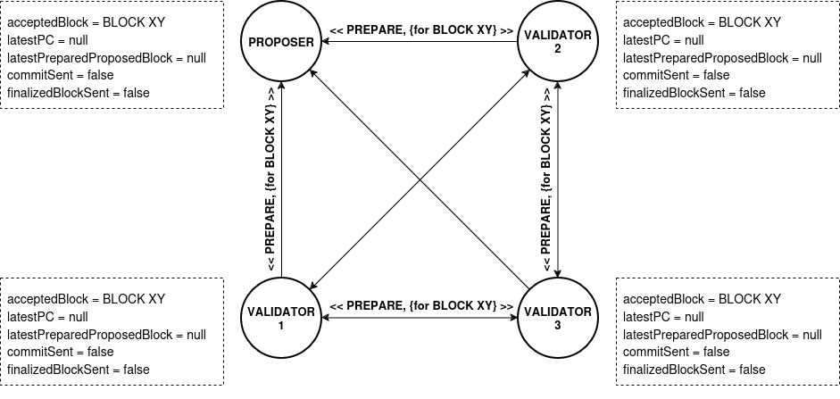
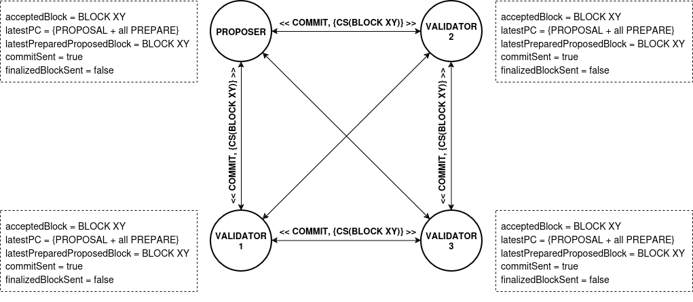
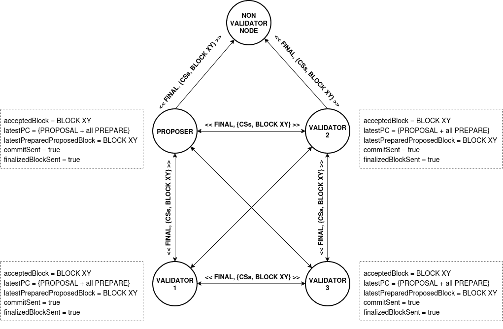

# IBFT 2.0 Consensus Algorithm

**Istanbul Byzantine Fault Tolerant (IBFT) 2.0** denotes an immediate finality consensus algorithm, resistant to Byzantine nodes, that bases its block decision-making functionality on the exchange of predefined signed messages within a dynamic set of validators.&#x20;

The set of validators changes at the epoch level, and if a node is part of the set (acting as a validator for a given epoch), it initiates [the IBFT decision making process](./#ibft-desicion-making-process) for every block within that epoch.&#x20;

Non-validator nodes, on the other hand, are engaged in standard synchronization where they wait for a new block to arrive and, upon its successful validation against all other consensus rules, integrate the block into the existing chain.&#x20;

Before delving into the algorithm itself, a few points need to be emphasized:&#x20;

* **all messages exchanged between validators are signed** - where each message contains a round and height for which they are intended. This ensures that messages for a specific height and round do not interfere with messages related to another round and height.&#x20;
* **a validator sends messages to all validators**  - that is, by broadcasting, a validator sends messages not only to all other validators in the set but also to itself. Although the algorithm is, for simplicity, explained as a phase transition process, in reality, each phase executes as soon as its corresponding conditions are met, regardless of the validator's previous phase.&#x20;

Here, a generalized overview of the IBFT 2.0 consensus algorithm, is described. It uses a set of 4 nodes. For more details on how the algorithm functions, as well as mathematical proofs of its correctness, please refer to the official documentation.

## Quorum function

Definition of a _Quorum function_ used in IBFT 2.0, where n is a number of validators:

$$
Quorum(n) \equiv  \bigg \lceil \cfrac  {2n} {3} \bigg \rceil
$$

## IBFT Desicion Making Process

The decision-making process in IBFT 2.0 consensus algorithm is divided into rounds. If a necessary quorum is not reached in a round, meaning no decision is made about the next block, the process moves to the next round. The duration of each round increases exponentially. In each round, one validator from the validator set takes on the role of the proposer for the next block, rotating through a round-robin principle.&#x20;

Upon initiating the algorithm, all validators start the corresponding timer for the initial (0) round and set state variables to their default values. The proposer additionally constructs a block, accepts it (by setting the <mark style="color:red;">`acceptedPB`</mark> state variable to the created block), and then proposes it to other validators in the validator set by broadcasting a `<<`<mark style="color:red;">`PROPOSAL`</mark>`>>` message.&#x20;

Here is the list of all state variables and their initial values (we will delve into their roles as they become relevant):

1. <mark style="color:red;">`acceptedBlock`</mark> <mark style="color:red;"></mark><mark style="color:red;">= ⊥</mark>
2. `latestPC` (PC - Prepared Certificate) = ⊥
3. `latestPreparedProposedBlock` = ⊥
4. `commitSent` = false
5. `finalisedBlockSend` = false

### Pre-prepare Phase

<figure><figcaption>
Pre-prepare Phase - Validators' Behavior
</figcaption></figure>

If a validator is in the initial, zeroth round and has not yet received a proposal (`acceptedPB` = ⊥), upon receiving a `<<PROPOSAL>>` message, it conducts certain checks. The most critical ones include:

* verifying whether the proposal is for the initial round,&#x20;
* confirming that the block adheres to consensus rules, and&#x20;
* ensuring it was sent by a validator for the initial round.&#x20;

### Prepare Phase

If all these conditions are met, the validator proceeds into the prepare phase, accepts the provided block (`acceptedPB` = proposed block), and broadcasts a `<<PREPARE>>` message. By setting `acceptedPB`, the node indicates that it was in the prepare phase for the given round (in this instance, the initial one). This phase is the sole divergence from the process applied in subsequent, higher rounds; all other phases remain consistent irrespective of the round in which they are executed.

<figure><figcaption>
Prepare Phase - Validators' Behavior
</figcaption></figure>

### Commit Phase

To proceed to the next (commit) phase, a validator must receive at least quorum-1 valid `<<PREPARE>>` messages. In our case, this corresponds to 2 PREPARE messages (refer to the [_Quorum function_ ](./#quorum-function)formula). One is subtracted from the quorum-defined number because it is assumed that the proposer automatically agrees with their proposal, thereby accepting it.&#x20;

Beyond receiving a sufficient number of `<<PREPARE>>` messages, additional conditions include the validator not being in the commit phase (`commitSent` = false) for the current round and having completed the prepare phase (`acceptedPB` != ⊥) for the given round. If the previously defined conditions are met, the validator enters the commit phase, signified by setting the `commitSent` state variable to true.&#x20;

Upon entering this phase, the validator generates a signature (commit seal) over the received proposal (the one in `acceptedPB`) and broadcasts it to all other validators in the set through a `<<COMMIT>>` message. Additionally, values for the variables `latestPC` and `latestPreparedProposedBlock` are set. These variables hold a significant role when the decision-making process transits into subsequent rounds. The first variable, `latestPC`, precisely contains one `<<PROPOSAL>>` message (sent by the validator for that round; contains his block proposal) and all received valid `<<PREPARE>>` messages (at least quorum-1) corresponding to the given `<<PROPOSAL>>` message and the proposal within it. Therefore, `latestPC` serves as evidence that a sufficient number of nodes were prepared to adopt a specific proposal in a particular round, but it did not materialize for some reason. The second variable, `latestPreparedProposedBlock`, contains the proposal itself (from `acceptedPB` state variable).

<figure><figcaption>
Commit Phase - Validators' Behavior
</figcaption></figure>

### Finalization Phase

The conclusive, finalization phase commences once a validator receives at least a quorum valid `<<COMMIT>>` messages. It is necessary that the node has previously been in the prepare phase (`acceptedBlock` != ⊥) for the given round and has not been in the finalization phase (`finalisedBlockSent` = false). If previously satisfied, the validator will first extract a commit seal from each `<<COMMIT>>` message. Subsequently, it constructs a finalization block composed of the set of commit seals and the proposed block (from the `acceptedPB` state variable). The finalization block is then broadcasted to **ALL** nodes in the network, not just validators. Upon receiving this finalization block, all nodes can utilize commit seals to verify the occurrence of agreement among validators. If the verification holds, nodes can then apply additional consensus rules to the block and include it into the chain.

<figure><figcaption>
Finalization Phase - Validators' Behavior
</figcaption></figure>

In this way, the core functionality of the IBFT 2.0 consensus algorithm is brought to an end.&#x20;

### Case of No Agreement&#x20;

The following discussion outlines the process that unfolds in the case when an agreement is not reached in the initial, zeroth round. It is crucial to note that all modifications are strictly related to the pre-commit phases.

When the timer for the current round expires (regardless of the round number), the transition to the next round occurs. Upon starting the timer and, by that, initiating the round, the `acceptedPB`, `commitSent` and `finalisedBlockSend` variables are reset to their initial values. However, `latestPC` and `latestPreparedProposedBlock` retain their values because their role is to indicate the last round when the given validator was in the prepare phase, and thus when the network, from his perspective, was last ready to accept the proposal, but it did not happen. After the preceding is carried out, the validator broadcasts a `<<ROUND-CHANGE>>` message, which, among other things, includes its current round (like any other), `latestPC`, and `latestPreparedProposedBlock`.

<figure><figcaption>
 Move to the Next Round - Validators' Behavior
</figcaption></figure>

For the validator to continue its execution, it is necessary to receive at least a quorum of valid `<<ROUND-CHANGE>>` messages for any given round. This signifies that a sufficient number (at least a quorum) of validators are willing to transition to that round.&#x20;

The collection of valid `ROUND-CHANGE` messages received by a validator, all intended for transitioning to the same round, denotes a **Round-change Certificate** (RCC). Various validations are performed on `<<ROUND-CHANGE>>` messages within such a certificate. First, for the RCC to be accepted, it, or rather the `<<ROUND-CHANGE>>` messages within it, must either have a round greater than the current validator's round or the same one but without the currently accepted proposal (`acceptedPB` = ⊥).&#x20;

Additionally, a crucial check involves assessing the validity of the **Prepared Certificate** in each message within RCC. The Prepared Certificates in each of these messages can be entirely distinct. An empty prepared certificate is also considered valid, indicating that a validator, the sender of that `<<ROUND-CHANGE>>` message, has never reached the prepare phase in any round. If a validator receives a quorum of valid `<<ROUND-CHANGE>>` messages, that is, an RCC, for a round greater than its current one, it immediately transitions to that round and initiates a new timer with an appropriate duration.&#x20;

If, following the transition, a validator becomes the proposer for that round, it initiates the process of creating a new proposal. This involves meticulously selecting, from all `<<ROUND-CHANGE>>` messages within the RCC, the one which Prepared Certificate is linked to the highest round.&#x20;

Subsequently, the validator opts for the block from that certificate to serve as the proposal. In case that all certificates are empty, the validator generates an entirely new block, akin to the process in the zeroth round. Ultimately, the proposed block is broadcasted using a `<<PROPOSAL>>` message, employing the same method as in the zeroth round, with the additional inclusion of the provided RCC.

<figure><figcaption>
Pre-prepare Phase in Higher Rounds - Validators' Behavior
</figcaption></figure>

If a validator receives a `<<PROPOSAL>>` message for a round greater than its current round or the same one (greater than 0), and no proposal has been accepted yet (`acceptedPB` = ⊥), the validator initiates various checks. The most crucial ones involve:

* &#x20;verifying that the message is sent by the proposer for that round and that&#x20;
* the Round-change Certificate (RCC) is valid (for example, checking that the round of the RCC, that is the rounds of all `<<ROUND-CHANGE>>` messages within it, correspond to the round specified in the `<<PROPOSAL>>` message).&#x20;

Upon successful checks, the validator examines the Prepared Certificate from the RCC. If all certificates are empty, it verifies only the correctness of the proposed block. Otherwise, it additionally checks whether the proposed block in the `<<PROPOSAL>>` message is indeed the one linked to the Prepared Certificate with the highest round among all messages in the RCC. In case everything is fine, the block is accepted (`acceptedPB` = proposed block), and a `<<PREPARE>>` message is broadcasted to all other validators in the same format as in the zeroth round. As previously noted, the entire process following this point remains consistent, regardless of the round.

In the next section we describe the initialization process of consensus components.
