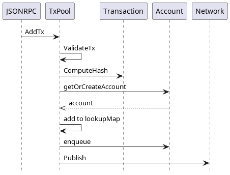

# Transaction Pool

The transaction pool, `TxPool`, is an in-memory structure that manages the incoming transactions for processing. It maintains a list of unprocessed transactions and ensures they conform to specific constraints before entering the pool.

## Model 

Details of `TxPool` structure are shown in the _TxPool Structure_ diagram.

<figure><figcaption>
TxPool Structure
</figcaption></figure>

TxPool fields:

* **`logger`** - logger interface that defines applicable logger methods,
* **`signer`** _-_ signer interface that defines a transaction sender,
* **`forks`** - represents a map which contains all forks and their starting blocks from genesis,
* **`store`** _-_ interface defines State helper methods the `TxPool` should have access to,
* **`accounts`** - map of all accounts registered by the pool,
* **`executables`** - represents all the primaries (i.e. transactions ready for execution) sorted by max gas price,
* **`index`** - lookup map keeping track of all transactions present in the pool,
* **`topic`** - networking stack,
* **`gauge`** - gauge for measuring pool capacity,
* **`priceLimit`** - represents a lower threshold for gas price,
* **`sealing`** - flag indicating if the current node is a sealer (validator), and should therefore gossip transactions,
* **`baseFee`** - represents the base fee of the current head. This is needed to sort transactions by price,
* **`eventManager`** - event manager for `TxPool` events,
* **`pending`** - represents the list of pending and ready transactions. This variable is accessed with atomics,
* **`chainID`** - chain ID,
* **`localPeerID`** - represents the peer ID of the local node that is running the `TxPool`.

Some of the main `TxPool` methods include:

* **`NewTxPool`** - `NewTxPool` creates and returns a new pool for processing incoming transactions,
* **`Start`** _-_ runs the pool's main loop in the background. On each request received, the appropriate handler is invoked in a separate goroutine,
* **`Close`** - shuts down the pool's main loop,
* **`SetSigner`** - sets the signer the pool will use // to validate a transaction's signature,
* **`AddTx`** - adds a new transaction to the pool (sent from json-RPC/gRPC endpoints) and broadcasts it to the network (if enabled),
* **`Prepare`** - generates all the transactions ready for execution. (primaries),
* **`Peek`** - returns the best-price selected transaction ready for execution,
* **`Pop`** - removes the given transaction from the associated promoted queue (account). It will update `executables` with the next primary from that account (if any),
* **`Drop`** - clears the entire account associated with the given transaction and reverts its next (expected) nonce,
* **`Demote`** - excludes an account from being further processed during block building due to a recoverable error. If an account has been demoted too many times, it is Dropped instead,
* **`ResetWithBlock`** _-_ processes the transactions from the newly finalized block to sync the pool with the new state,
* **`ReinsertProposed`** - returns all transactions from the accounts proposed queue to the promoted queue. It is called from consensus algorithm, when new round > 0 starts or when current sequence is cancelled.
* **`ClearProposed`** _-_ clears accounts proposed queue when round 0 starts. It is called from consensus algorithm.

## TxPool Instantiation 

Every node has a single instance of `TxPool` in-memory structure, which is created on the node startup. `NewTxPool` method is in charge of creating a new `TxPool` populated with static and dynamic content. Afterwards, transaction `TxPool`'s signer is created and assigned, base fee is determined and assigned, and TxPool is started. `TxPool` listens for a shutdown event, prunes accounts with nonce holes and handles promoted transactions.

<figure><figcaption>
TxPool Instantiation Process Sequence Diagram
</figcaption></figure>

## Role of TxPool in Block Creation 

`BlockBuilder`'s `Fill` method uses `TxPool` to fill the block with transactions taken from`TxPool`. Each transaction is validated one by one, and valid transactions are added to the`BlockBuilder`'s list of transactions. Transactions are validated until a predefined timer (for block creation) expires or a predefined gas (for prepared transactions) is spent.

_Block Creation Sequence Diagram_ gives a detailed overview of block creation actions. `BlockBuilder`'s is in charge of:

* creating a block timer that limits the time interval allowed for block creation, and
* preparing transactions in `TxPool`, where all transactions ready for execution are sorted descending by best price (i.e., transaction fee), giving an advantage to more expensive ones.

After the block timer is set and transactions are prepared, transactions are taken from the `TxPool` and checked for their validity during the transaction write process. The process adds a valid transaction to the block and removes it from the `TXPool`.

If the transaction is invalid, then, depending on the error, the transaction is dropped or demoted from the `TxPool`. A dropped transaction assumes that its entire account is cleared and its nonce is reverted, while a demoted transaction assumes that its account is excluded from further processing during block building due to a recoverable error. Still, if an account is demoted too many times, it will be dropped instead.

If the gas limit is reached, the block creation is finished. Otherwise, the process is repeated with the next transaction from the `TxPool` until the predefined time expires.

<figure><figcaption>
Block Creation Sequence Diagram
</figcaption></figure>

## Adding Transactions to TxPool 

As the process of `TxPool` instantiation and its role in block creation are described, let us see how `TxPool` is populated with new (potential) transactions.

The main source of new transactions is the `JSONRPC` component. This component, more precisely a remote procedure call protocol, is used for communication of Blade nodes with the outer world. Since `JSONRPC` utilizes JSON, it relies on the same type system.

`TxPool` receives new transactions through its `SendRawTransaction` method via the `JSONRPC` component. The method calls `TxPool`'s `AddTx` to pass received transactions. `AddTx` conducts a series of validation checks on a transaction. When validation fails, an appropriate error message is thrown, and the transaction is skipped from being added to TxPool.

Transaction validations include:

* **state transaction check** - as transactions with `StateTxPType` transaction type are not expected to be added to the `TxPool`,
* **transaction size check** - as a transaction size cannot exceed 128 kB, which helps to overcome DOS attacks,
* **transaction value check** - as transactions strictly have positive values,
* **smart contract deployment check** - checks if a transaction can deploy a smart contract,
* **forks check** - depending on the transaction type and given fork, it checks whether the transaction is allowed:
  * **`AccessListTxType`** - this transaction type is applicable only when Berlin hardfork (eip-2930) is enabled and the transaction is not underpriced,
  * **`DinamicFeeTxType`** - this transaction type is applicable only when London hardfork is enabled, where GasFeeCap and GasTipCap fields have correct values and the transaction is not underpriced,
  * **other transaction types** - these transaction types are applicable only when London hardfork is enabled and the transaction is not underpriced,
* **transaction underpriced check** - as underpriced transactions are not allowed in regards to price limits,
* **transaction pool signer check** - as the transaction pool has to be signed properly, i.e., the transaction pool sender (i.e., signer) has to be present,
* **transaction signer check** - as the transaction's `From` field, if set, must match the signer. Otherwise, it is set to signer value.
* **transaction block gas limit check** - as a transaction gas must not exceed the latest block gas limit
* **transaction intrinsic gas check** - as a transaction must have more gas than the basic transaction fee (intrinsic gas is a constant transaction fee),
* **transaction nonce check** - as transaction nonce cannot be lower than account nonce,
* **sender funds check** - as a transaction sender must have enough funds to execute the transaction.

When a validation fails, an appropriate error is raised, and the transaction is skipped. When all checks pass successfully, the following actions are taken:

* chain ID is set for `DinamicFeeTxType` transactions,
* transaction hash is calculated,
* account (of transaction sender) is added to `TxPool`, if not already there,
* in a case of high pressure in the pool, transaction nonce is checked against account nonce, and if the nonce was not expected transaction is rejected,
* a check is done to find an existing transaction with the same nonce for the current account and the same hash, in which case the transaction is rejected as well,
* if a transaction with the same nonce is found, with a different hash but having the same or better gas price, the transaction is also rejected,
* when a transaction with the same nonce is not found,
  * if the account has reached a maximum number of transactions and the transaction nonce differs from account nonce, transaction is rejected,
  * transaction nonce cannot be lower than account nonce, in that case the transaction is rejected
* if there is an existing transaction with the same nonce, then the new transaction tries to occupy its slot without exceeding the transaction pool limits. If a transaction overflow happens, the transaction is rejected.
* the new transaction is then added to the `lookupMap,` and the old one with the same nonce is removed (if it existed),
* the transaction is then added or replaced in the current account,
* <mark style="color:red;">a promotion event is raised when the transaction nonce is less than or equal to the account nonce.</mark>
* later, transactions are published to other nodes through the network (assuming that a node has the ability to send transactions and subscriptions are present). Network nodes handle received transactions through `TxPool`'s `addGossipTx` handler method, where they add transactions to their pool.

<figure><figcaption>
Adding Transaction to TxPool Sequence Diagram
</figcaption></figure>
