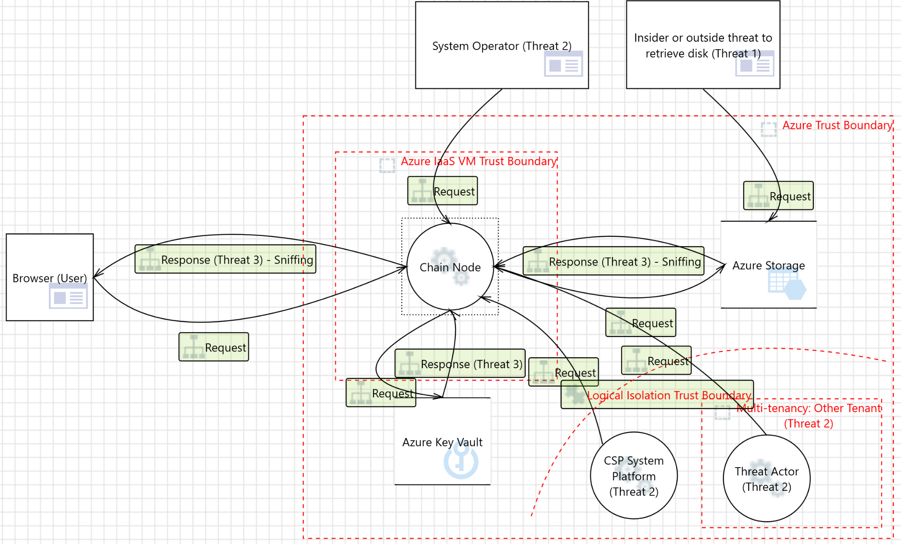

# Risk Based Methodology

From an attacker perspective, it is important to understand that data is typically the end goal of the attacker to deliver the impact of the attack. Per MITRE ATT\&CK framework (see [here](https://attack.mitre.org/matrices/enterprise/)), exfiltration (see [here](https://attack.mitre.org/tactics/TA0010/)) deserved a separate category. However, turning to the STRIDE framework and focusing on Information Disclosure, we can focus on the virtual machines hosting App chain nodes and the communication among these nodes to identify and narrow down the threats requiring mitigation during the operation of Blade.

## **Threat 1** - Sensitive data in the VM can be disclosed if the OS or the file system in the virtual machine is not encrypted

This threat is mitigated through common mitigation strategies, which involve encrypting disks utilized by virtual machines. These strategies leverage configurations supported by all major cloud vendors. Typically, they rely on standard mechanisms built for different operating system versions – BitLocker for Windows OS family and DM-Crypt technology for UNIX based OS family.

It is important to ensure the encryption keys are stored properly and careful consideration regarding the entity responsible for generating these keys is crucial. More about proper key management can be found in the Key Vaults section of this document.

**The recommendation:** Today, full disk encryption is expected practice to ensure **data at rest** encryption and it should be done in almost all cases when using public cloud resources.

\[More information – Azure]: [Sensitive Data - Microsoft Threat Modeling Tool - Azure | Microsoft Learn](https://learn.microsoft.com/en-gb/azure/security/develop/threat-modeling-tool-sensitive-data#disk-vm)

\[Configuration – Azure]: [Azure Disk Encryption scenarios on Windows VMs](https://learn.microsoft.com/en-us/azure/virtual-machines/windows/disk-encryption-windows)

\[Configuration – AWS]: [Encryption best practices](https://docs.aws.amazon.com/prescriptive-guidance/latest/encryption-best-practices/services-best-practices.html) and specifically, for [VMs.](https://docs.aws.amazon.com/prescriptive-guidance/latest/encryption-best-practices/ec2-ebs.html)

\[Configuration – GCP]: [Encrypt disks with customer-supplied encryption keys](https://cloud.google.com/compute/docs/disks/customer-supplied-encryption)

**Blade mitigation:** In the deployment phase of the Blade chain, the configuration for instantiating VMs that host Blade nodes is tailored based on the selected cloud provider. This configuration is specifically designed to activate disk encryption. The combined effect of this applied configuration and the cloud provider's capability to encrypt disks ensures comprehensive protection for sensitive data within Blade.

## **Threat 2 –** Sensitive data can be accessed without customers consent by a vulnerability in CSP platform or it could include a malicious system operator

The concept of confidential computing protects the data from cloud system software vulnerabilities preventing even other tenants from exploiting other tenants' data, cloud operators, and with the concepts of enclaves, it protects the data from software operators as well. It achieves these goals by relying on TEE (Trusted Execution Environment) supported by new hardware technologies where processors separate different execution areas segregating the data and application code from the OS context. The encryption keys are stored within the processor chips themselves. We may say that this mitigation strategy relies on **data at rest and data in use** encryption.

All sensitive workloads should explore the option of using TEE virtual machines for elevated data protection.

Trusted computing also has a use case for enterprise blockchains as it enables preserving confidentiality of blockchain data (see [here](https://www.intel.com/content/dam/www/public/us/en/documents/solution-briefs/intro-to-confidential-computing-solution-brief.pdf)) by ensuring only authorized parties can see the data and transaction happening on the permissioned blockchain network.

**The recommendation:** If the target application works with sensitive data or has high-risk profile data and is being considered for public cloud deployment, trusted VMs and in general, confidential computing services fall under a **must requirement** category.

\[More information – Azure]: [Confidential Computing – Protect Data In Use | Microsoft Azure](https://azure.microsoft.com/en-us/solutions/confidential-compute)

\[Configuration – Azure VM]: [About Azure confidential VMs](https://learn.microsoft.com/en-us/azure/confidential-computing/confidential-vm-overview)

\[More information – AWS]: [Confidential computing: an AWS perspective](https://aws.amazon.com/blogs/security/confidential-computing-an-aws-perspective/)

\[Configuration – AWS VMs (EC2)]: Today, memory encryption is enabled by default on all [Graviton2-based instances](https://aws.amazon.com/ec2/graviton/) (T4g, M6g, C6g, C6gn, R6g, X2g), and Intel-based [M6i instances](https://aws.amazon.com/blogs/aws/new-amazon-ec2-m6i-instances-powered-by-the-latest-generation-intel-xeon-scalable-processors/), which have Total Memory Encryption (TME).

\[More information – GCP]: [Introducing Google Cloud Confidential Computing](https://cloud.google.com/blog/products/identity-security/introducing-google-cloud-confidential-computing-with-confidential-vms)

\[Configuration – GCP]: From the link above: all GCP workloads you run in VMs today can run as a Confidential VM. One checkbox - it’s that simple.

**Blade mitigation:** During the deployment phase of the Blade chain, Trusted Execution Environment (TEE) virtual machines serve as the foundational hosts for the nodes. This strategic choice reflects a deliberate architectural decision aimed at providing the security and reliability of Blade infrastructure. By leveraging TEE virtual machines, Blade ensures a heightened level of trustworthiness in its node hosting environment. TEE technology provides a secure execution environment that safeguards critical operations and data within isolated enclaves, protecting against unauthorized access and tampering attempts.

## Threat 3 - Sensitive data can be sniffed through unencrypted traffic

TLS is a protocol that encrypts data in transit between App chain nodes. This encryption ensures that sensitive information is protected from interception and unauthorized access. To implement TLS, one must rely on a TLS certificate from a reliable certificate authority (CA) which usually comes in the form of X509v3 standard certificate.

**The recommendation:** It is important to understand compliance needs as well as the risk profile of the software to understand where TLS traffic should be terminated, and this decision is usually a balance among security, management complexity and performance. In enterprise settings where the Blade chain is utilized, it is paramount to ensure encryption for all communication. This entails terminating TLS on an Blade node side rather than relying on Cloud Gateways. Relying on cloud services to operate the Blade chain, the optimal approach involves storing certificates securely within the Key Vault (see [here](https://learn.microsoft.com/en-us/azure/virtual-machines/linux/tutorial-secure-web-server)) and subsequently injecting them dynamically into the virtual machine during deployment. Private keys are maintained securely within the confines of the Key Vault.

**Blade mitigation:** As the Blade chain leverages gRPC as its primary communication protocol to construct its peer-to-peer network of nodes, taking advantage of the TLS wrapper supported by gRPC. Consequently, within the Blade framework, TLS is implemented as the preferred technique for encrypting data in transit.

\[More information – gRPC]: [Authentication | gRPC](https://grpc.io/docs/guides/auth/)
